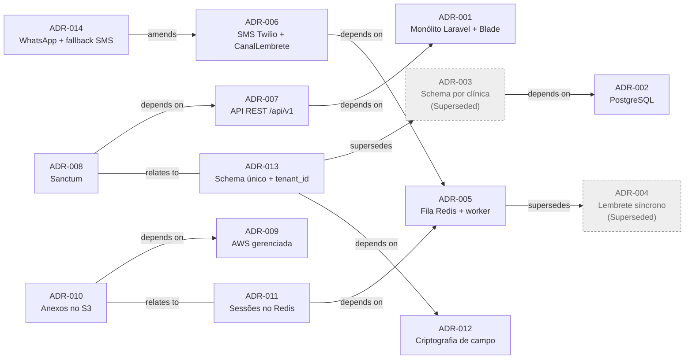

# Decisões arquiteturais da Horalis (2019 a 2025)

Este é o ponto de entrada das ADRs reconstruídas a partir do código, do histórico do git e dos rastros (`contexto/`, `docs/ARQUITETURA.md`, `docs/postmortems/`). Cada ADR cita os commits, os arquivos e os rastros em que se apoia. O que as fontes não respondem está marcado como **Needs Input**.

Formato: MADR, com títulos em português. Status do curso: Proposed, Accepted, Rejected, Deprecated, Superseded. Relações: supersedes, superseded by, amends, amended by, depends on, relates to.

## Linha do tempo

| Nº | Título | Status | Data | Needs Input |
|---|---|---|---|---|
| 001 | [Monólito Laravel com telas renderizadas em Blade](ADR-001-monolito-laravel-com-telas-em-blade.md) | Accepted | 2019-04-02 | sim (microsserviço de agenda abandonado) |
| 002 | [PostgreSQL como banco de dados](ADR-002-postgresql-como-banco-de-dados.md) | Accepted | 2019-04-02 | sim (motivo e alternativas) |
| 003 | [Um schema por clínica no banco](ADR-003-um-schema-por-clinica-no-banco.md) | Superseded | 2019-04-02 | não |
| 004 | [Envio síncrono de lembretes pelo comando agendado](ADR-004-envio-sincrono-de-lembretes-pelo-comando-agendado.md) | Superseded | 2019-06-03 | sim (alternativas) |
| 005 | [Fila Redis com worker dedicado para os lembretes](ADR-005-fila-redis-com-worker-dedicado-para-lembretes.md) | Accepted | 2020-02-12 | sim (revisão do SQS na AWS) |
| 006 | [Lembretes por SMS com Twilio, atrás da interface CanalLembrete](ADR-006-lembretes-por-sms-com-twilio-atras-da-interface-canallembrete.md) | Accepted | 2020-03-10 | não |
| 007 | [API REST versionada na URL, dentro do monólito](ADR-007-api-rest-versionada-na-url-no-monolito.md) | Accepted | 2021-02-17 | sim (abandono do GraphQL) |
| 008 | [Autenticação da API com tokens do Sanctum](ADR-008-autenticacao-da-api-com-tokens-do-sanctum.md) | Accepted | 2021-02-17 | sim (revogação na prática) |
| 009 | [Migração da infraestrutura da VPS para a AWS com serviços gerenciados](ADR-009-migracao-da-infraestrutura-para-a-aws.md) | Accepted | 2021-06-07 | sim (motivo, alternativas, decisores) |
| 010 | [Anexos no S3 com download por URL pré-assinada](ADR-010-anexos-no-s3-com-url-pre-assinada.md) | Accepted | 2021-08-10 | sim (alternativas) |
| 011 | [Sessões do painel no Redis](ADR-011-sessoes-do-painel-no-redis.md) | Accepted | 2021-08-10 | sim (alternativas, operação do Redis) |
| 012 | [Criptografia de campo para CPF e notas clínicas, com hash do CPF para busca](ADR-012-criptografia-de-campo-para-cpf-e-notas-clinicas.md) | Accepted | 2022-05-04 | sim (alternativas técnicas, gestão de chaves) |
| 013 | [Schema único com tenant_id e escopo global na aplicação](ADR-013-schema-unico-com-tenant-id-e-escopo-global.md) | Accepted | 2022-05-20 | não (registra divergência de motivo) |
| 014 | [WhatsApp Cloud API como canal principal dos lembretes, com fallback para SMS](ADR-014-whatsapp-cloud-api-como-canal-principal-com-fallback-para-sms.md) | Accepted | 2023-09-12 | não |

Decisões do mesmo dia (001 a 003 e 007 e 008) estão na ordem em que aparecem na ata ou na discussão. A data é sempre a de um commit ou rastro citado na própria ADR.

### O que vale hoje

- **Vigentes:** 001, 002, 005, 006 (emendada pela 014), 007, 008, 009, 010, 011, 012, 013 e 014.
- **Substituídas:** a 003 pela 013 e a 004 pela 005.

O `docs/ARQUITETURA.md` de 2019 descreve o estado das ADRs 003 e 004 e de outras práticas que já não existem. O retrato atual está em [`docs/HLD.md`](../HLD.md).

## Relações entre as ADRs

Uma seta por par. Supersedes e amends aparecem também do outro lado (superseded by, amended by), nos metadados da ADR de destino. Relates to é declarada nas duas ADRs do par.

## Candidatos avaliados que não viraram ADR

Usei a regra dos 3 Es. Uma decisão só vira ADR se for:

- **Estrutural:** afeta como o sistema é construído ou integrado;
- **Evidente:** outras pessoas vão precisar entender o porquê;
- **Estável:** dura meses ou anos, não semanas.

Se falha em qualquer um dos três, fica fora.

| Candidato | Evidência | Por que ficou de fora (3 Es) |
|---|---|---|
| Busca de pacientes com Laravel Scout + Meilisearch (POC revertida) | `a08461f`, `0494bd3`, `8629f57`, reverts `a9de541`, `307e564`, `c99efbb`; `contexto/slack/geral.md` (2023-05-09 a 2023-06-07) | Falha em **Estável**: era um teste com prazo de duas semanas ("ok, mas é teste. duas semanas e a gente decide", Rafael) e foi revertido inteiro três semanas depois. O que ficou foi não mudar nada, e a busca continuou no banco. Fica registrado aqui para que ninguém proponha de novo sem saber: o time achou que não compensava manter mais um serviço (índice, reindexação, backup, alerta) para uma diferença pequena com o volume da época (cerca de 30 mil pacientes na maior clínica). |
| Troca do php-cs-fixer pelo Pint | `d179407`, `97ab0bf`; `contexto/slack/geral.md` (2023-01-10) | Falha em **Estrutural**: é ferramenta de formatação de código. Não muda componente, integração nem comportamento. Esse tipo de convenção pertence a engineering guidelines, que estão fora do escopo. |
| Upgrades de versão do Laravel e do PHP (6, 8, 9, 10) e versionamento do `composer.lock` | `5f57d55`, `2069974`, `9cae2ef`, `40d1dc9`; `contexto/slack/arquitetura.md` (2023-07-05: "nada, só dependência") | Falha em **Estrutural**: é manutenção dentro da decisão da ADR-001. O framework e o formato do sistema continuam os mesmos, e a API "não mudou nada pra fora". |
| Upgrades de versão do PostgreSQL e do Redis (13, 15, 16; Redis 7) | `ea99585`, `3962b4f`, `c83bd4a`; `contexto/slack/arquitetura.md` (2024-02-07) | Falha em **Estrutural**: são atualizações das tecnologias escolhidas nas ADRs 002 e 005, sem mudança de arquitetura. |
| Timeout, tentativas e backoff dos jobs de lembrete | `83763e2`; `contexto/slack/arquitetura.md` (2024-03-12) | Falha em **Estrutural**: são valores de configuração (`$timeout = 30`, `$tries = 3`, `$backoff`) ajustados depois de um incidente. A estratégia é a da ADR-005, que registra o episódio como consequência. |
| Remoção do canal de e-mail dos lembretes | `5b4aca3`, `ecca671`; `app/Lembretes/Canais/EmailCanal.php` (no histórico) | Falha em **Evidente**: a decisão de trocar o e-mail pelo SMS é de 2020 e está na ADR-006 (o padrão passou a `sms` em `ecca671`). Em 2023 só foi apagada uma implementação que já não era usada. Não há porquê novo a explicar, e nenhuma fonte discute a remoção. |
| Sentry para monitorar erros | `2bc64ae`, `4e03756`; `config/sentry.php` | Falha em **Estrutural**: são poucas linhas no handler de exceções e um SDK, sem efeito sobre como o sistema é organizado ou integrado, e é trocável sem mexer na arquitetura. Está descrito no HLD, seção de observabilidade. |
| Evento `AgendamentoStatusAlterado` com listeners síncronos | `8aad4ed`, `9c5c3ab`, `3f24942`; `app/Events/AgendamentoStatusAlterado.php` | Falha em **Estrutural**: é um evento interno do Laravel com dois listeners, restrito ao módulo de agenda, sem barramento nem processamento assíncrono. As fontes não discutem o padrão. Está descrito no HLD, seção de componentes. |
| Regras de janela de deploy (sem deploy na sexta, congelamento no fim do ano, migrations grandes depois das 20h) | `contexto/slack/arquitetura.md` (2020-02-14, 2022-12-15), `contexto/slack/geral.md` (2024-12-13), `docs/postmortems/2022-04-12-deploy-travado.md` | Falha em **Estrutural**: é processo de operação, não arquitetura do sistema. |
| Extração do serviço de disponibilidade | `e3b2252`, `8cd4f7d`; `app/Agenda/Disponibilidade.php` | Falha em **Estrutural**: é refatoração interna, que move código para uma classe sem mudar componentes, integrações nem contratos. |
| Troca do minio pelo `adobe/s3mock` no compose de desenvolvimento | `72295a3`, `23ac85a`; `docker-compose.yml` | Falha em **Estrutural** e em **Evidente**: afeta só o ambiente local, que simula o S3. A decisão de usar S3 é a ADR-010. |

### Consolidados em outra ADR (não são decisões separadas)

- **Hospedagem em VPS única (2019):** registrada como contexto da ADR-009 (`contexto/atas/2019-04-02-kickoff-tecnico.md`, `48fa4b5`).
- **Eloquent como ORM:** vem com o Laravel (ADR-001). Nenhuma fonte trata como decisão própria.
- **Cabeçalho `X-Clinica`, trocado pelo dono do token na API:** detalhe de implementação das ADRs 003 e 013 (`e75f608`, `9356b12`).
- **Scheduler em contêiner próprio:** parte da migração da ADR-009 (`d93c79b`).

## Artefatos intermediários

A pasta [`rascunhos-ia/`](rascunhos-ia/LEIA-ME.md) guarda o mapeamento e os potenciais ADRs gerados pelos plugins. Não são ADRs e não foram revisados linha a linha.
